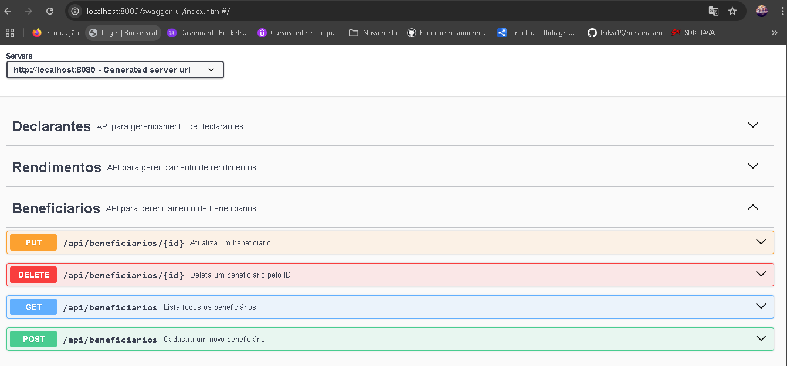

# 📌 API de Informes de Rendimento

API desenvolvida em **Spring Boot** para gerenciar declarações de imposto de renda, utilizando **Flyway** para controle de migrações e **MySQL** rodando em um contêiner Docker.

---

## 🚀 Tecnologias Utilizadas

- **Java 17**
- **Spring Boot 3**
- **Spring Data JPA**
- **Flyway** (Gerenciamento de migrações)
- **MySQL** (Banco de dados)
- **Docker** (Para subir o MySQL)
- **Swagger UI** (Documentação da API)

---

## 🏗️ Arquitetura da Aplicação

```plaintext
           +--------------------+
           |    Cliente/API     |
           +--------------------+
                    |
                    v
           +--------------------+
           |    Spring Boot     |
           +--------------------+
                    |
                    v
    +--------------------------------+
    | Banco de Dados (MySQL + Flyway) |
    +--------------------------------+
```

A aplicação segue uma arquitetura baseada em **REST APIs**, onde as requisições dos clientes são processadas pelo **Spring Boot**, que interage com o **MySQL** através do **Spring Data JPA** e mantém as migrações de banco organizadas com o **Flyway**.

---

## 🛠️ Como Configurar e Rodar o Projeto

### **1️⃣ Clonar o repositório**

```sh
 git clone <URL_DO_REPOSITORIO>
 cd <NOME_DO_PROJETO>
```

### **2️⃣ Subir o banco de dados MySQL com Docker**

Caso ainda não tenha o MySQL rodando localmente, utilize o Docker para subir um contêiner:

```sh
docker-compose up -d
```

Se não houver um `docker-compose.yml`, crie um arquivo e adicione:

```yaml
version: '3.8'
services:
  mysql:
    image: mysql:8.0
    container_name: mysql-container
    restart: always
    environment:
      MYSQL_ROOT_PASSWORD: root
      MYSQL_DATABASE: informe_rendimento
      MYSQL_USER: user
      MYSQL_PASSWORD: password
    ports:
      - "3306:3306"
```

### **3️⃣ Configurar o application.properties**

Verifique se o arquivo `src/main/resources/application.properties` contém as configurações corretas:

```properties
spring.datasource.url=jdbc:mysql://localhost:3306/informe_rendimento?createDatabaseIfNotExist=true&serverTimezone=UTC
spring.datasource.username=user
spring.datasource.password=password
spring.datasource.driver-class-name=com.mysql.cj.jdbc.Driver

# Configuração do Flyway
spring.flyway.enabled=true
spring.flyway.baseline-on-migrate=true
```

### **4️⃣ Rodar a aplicação**

Se estiver usando **Maven**, rode o seguinte comando:

```sh
mvn spring-boot:run
```

Ou, se preferir, execute diretamente a classe `DemoApplication.java` dentro da IDE.

---

## 📖 Documentação da API

A API possui uma interface Swagger para facilitar o uso:

🔗 Acesse: [http://localhost:8080/swagger-ui.html](http://localhost:8080/swagger-ui.html)



---

## 🗄️ Flyway - Controle de Versão do Banco

O **Flyway** é responsável pela criação e atualização do banco de dados via scripts de migração. Os scripts devem ser adicionados em:

```
src/main/resources/db/migration/
```

Exemplo de um script de migração:

```sql
-- V1__create_table_rendimentos.sql
CREATE TABLE rendimentos (
    id BIGINT AUTO_INCREMENT PRIMARY KEY,
    descricao VARCHAR(255) NOT NULL,
    valor DECIMAL(10,2) NOT NULL,
    data DATE NOT NULL
);
```

Para rodar as migrações manualmente:

```sh
mvn flyway:migrate
```

---

## ✅ Contribuição

Sinta-se à vontade para contribuir com melhorias e correções. Para isso:

1. **Crie um fork** do repositório
2. **Crie uma branch** para sua feature: `git checkout -b minha-feature`
3. **Faça commit** das suas alterações: `git commit -m 'Adicionando nova feature'`
4. **Faça push** para a branch: `git push origin minha-feature`
5. **Abra um Pull Request** 🚀

---

## 📜 Licença

Este projeto está sob a licença **MIT** - sinta-se livre para usá-lo e modificá-lo! 😉

